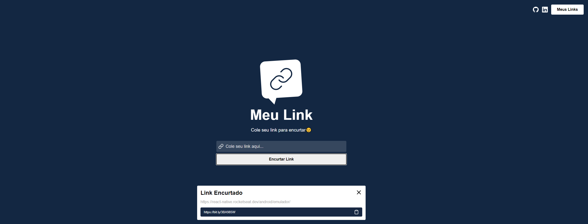
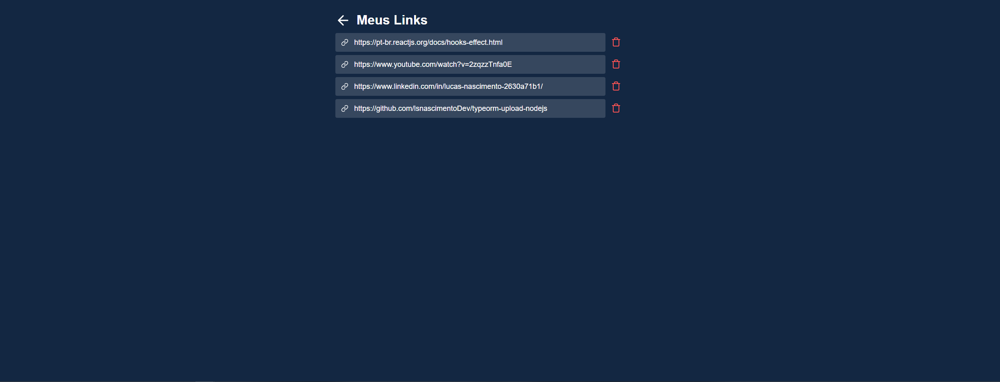

<h1 align="center">


<h1 align="center">


<h1 align="center">


# Indice

- [Sobre](#-sobre)
- [Tecnologias Utilizadas](#-tecnologias-utilizadas)
- [Como baixar o projeto](#-como-baixar-o-projeto)


## ✍ Sobre
</br>

Meu Link é uma aplicação desenvolvida para encurtamento de links de forma simples e eficiente.

A aplicação possui três paginas: A home, pagina dos links salvos- localStorage, e uma página que é redenrizada quando o usuário digita uma url inexistente.

O consumo da api Bitly é realizado pelo Axios.

---

## 🔧 Tecnologias utilizadas
</br>

- [ReactJS](https://reactjs.org)
- [Axios](https://axios-http.com/docs/intro)
- [Bitly](https://app.bitly.com/)


## ⚡ Como baixar o projeto
</br>

```bash

# Clonar o repositório
$ git clone https://github.com/lsnascimentoDev/meuLink-reactJS.git

# Entrar no diretório
$ cd meulink

# Instalar as dependências
$ yarn install

# Iniciar o projeto
$ yarn start
```


---


